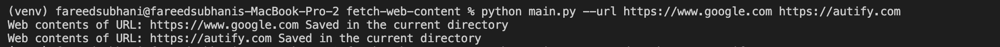
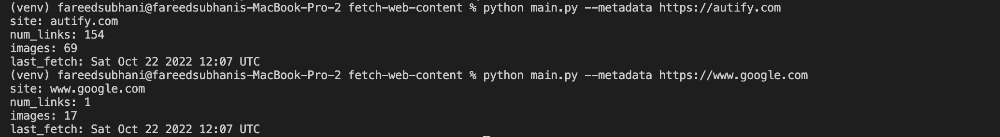
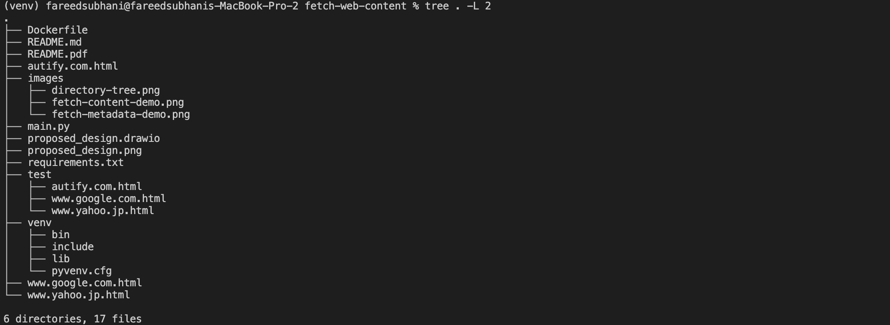
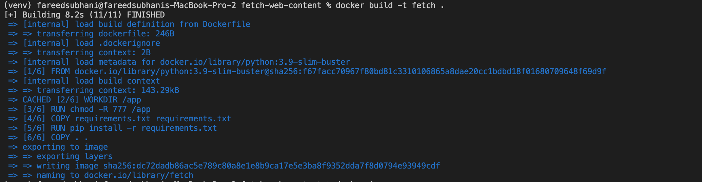
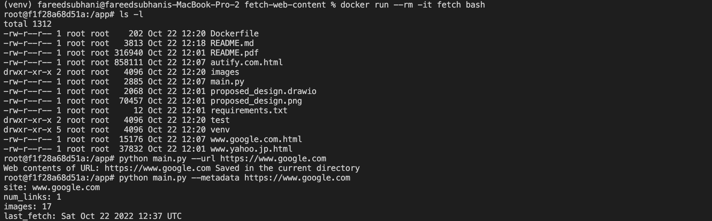
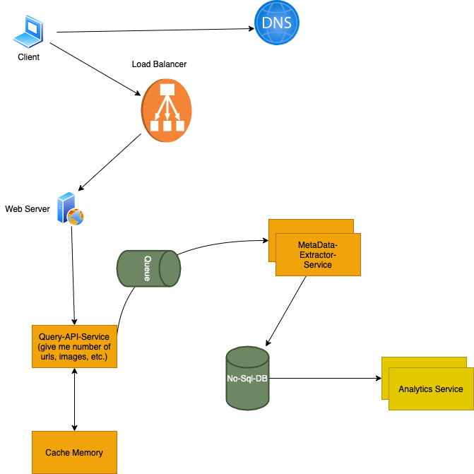

# Assignment

<!-- TOC -->

- [Table of Contents](#Table-of-Contents)

  - [1.0 Problem Statement](#10-Problem-Statement)
  - [2.0 Approaches/Discussion](#20-Approaches/Discussion)
  - [3.0 Testing and running](#30-Testing-and-running)
  - [4.0 Future Design and Thoughts](#40-Future-Design-and-Thoughts)

  <!-- /TOC -->

#### 1.0 Problem Statement:

Implement a command line program that can fetch web pages and saves them to disk for later retrieval and browsing.

**Section 1**

For example, if we invoked your program like this: `./fetch [https://www.google.com](https://www.google.com)` then in our current directory we should have a file containing the contents of `www.google.com`. (i.e. `/home/myusername/www.google.com.html`).

**Section 2**

Record metadata about what was fetched:

- What was the date and time of the last fetch
- How many links are on the page
- How many images are on the page

Modify the script to print this metadata.

For example (it can work differently if you like)

#### [2.0 Approaches/Discussion](#20-Approaches/Discussion)

- There are many approaches to this problem
- For **_section-1_**
- I have used [Python reqeusts](https://requests.readthedocs.io/en/latest/) library to get the URL Content
- From the command line if you run this command 
- > python main.py --url https://www.google.com https://autify.com < ... >
- Demo  - main fucntion calls downloadHTML class which args as an argument.
- Then it will process each URL and save it in the local disk with the filename of the website name + html. 
- Note that I have used **stream = True** in the GET Method and have used chunk_size in each iter_contens
- _REASON_ :
  This avoids reading the content all at once into memory for large responses. Especially if we have to deal with large images/video files.

- For **_section-2_**

  - From the command line if we execute this command
  - > python main.py --metadata https://www.google.com
  - As shown in this image:
    - 
  - We needed to find mainly three pieces of information
    - date and time of the last fetch
    - Number of links in the content
    - Number of Images in the content
  - _Approach_
    - Last-Fetch:
      - I have used the Python os [stats](https://docs.python.org/ja/3/library/stat.html) module to get the last date and time of the modified file.
      - Again I have used the [datetime](https://docs.python.org/3/library/datetime.html) module and formatted the DateTime object using [strftime](https://docs.python.org/3/library/datetime.html#datetime.date.strftime) in the desired output format.
    - Count of Images and URLs:
      - I have used the getMetadata class which again calls the ProcessMetadata class
      - I have used [BeautifulSoup](https://pypi.org/project/beautifulsoup4/) library to get the count of images and URL tags from the HTML file.

#### [3.0 Testing and running](#30-Testing-and-running)

- System environment:
  - Python 3.9.0
  - MacBook-Pro(macOS Monterey v12.5)
- Directory Tree: -
- **_Build and runing dockerfile_**

  - Build a docker file using the command below

    > docker build -t fetch .

    

  - execute this command

    > docker run --rm -it fetch bash

  - now you are in
    > root@build-image:/app# directory
  - run the usual command i.e.

    > python main.py --url https://www.google.com

    to fetch URL content and

    > python main.py --metadata https://www.google.com

    to get metadata of the URL

  - here is a demo for the same
    

  #### [4.0 Future Design and Thoughts](#40-Future-Design-and-Thoughts)

  - Due to time constraints I was not able to code it in a better way
  - I could have introduced a feature like saving all the contents
  - We can make the code more modular for better code-reusability
  - We can introduce various design patterns.
  - Of course, this solution is not very practical if needs to handle very large requests from the user.
  - I have come to a design if I were designing this service
    - Here is my idea for High-level design
      
    - Again this is also not a perfect solution As we can improve a lot of components
  - Personally, I really enjoyed solving this problem, particularly scaling part, when we have to design and implement this service we have to think about scaling and best practices as well, Thank you!
